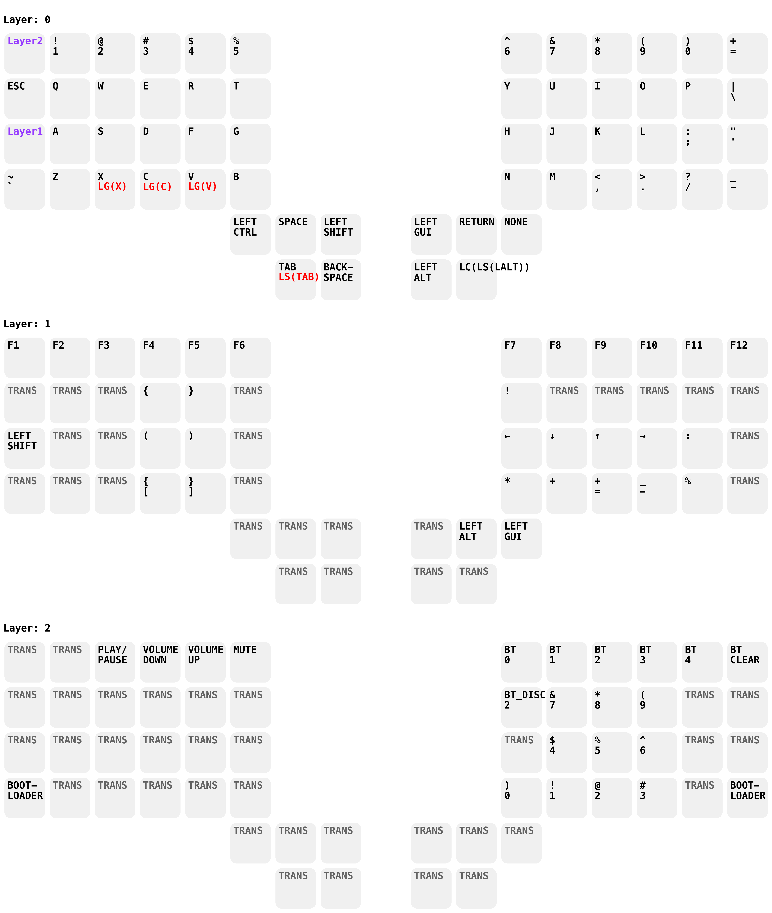

# ZMK Keyboard Configurations

This repository contains my private ZMK keyboard configurations.

# Daily driver

My current daily driver is the [Scylla](https://github.com/Bastardkb/Scylla)
keyboard by [BastardKB](https://bastardkb.com).

## Keymap

This is my current keymap visualized using my [keymap visualzier](https://github.com/huber-th/zmk-keymap-visualizer).

